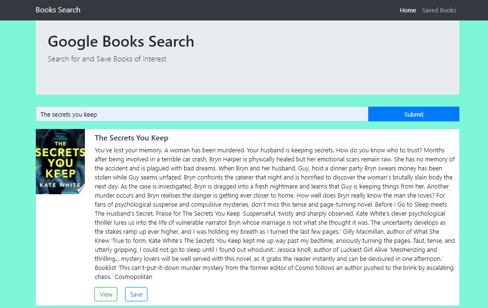
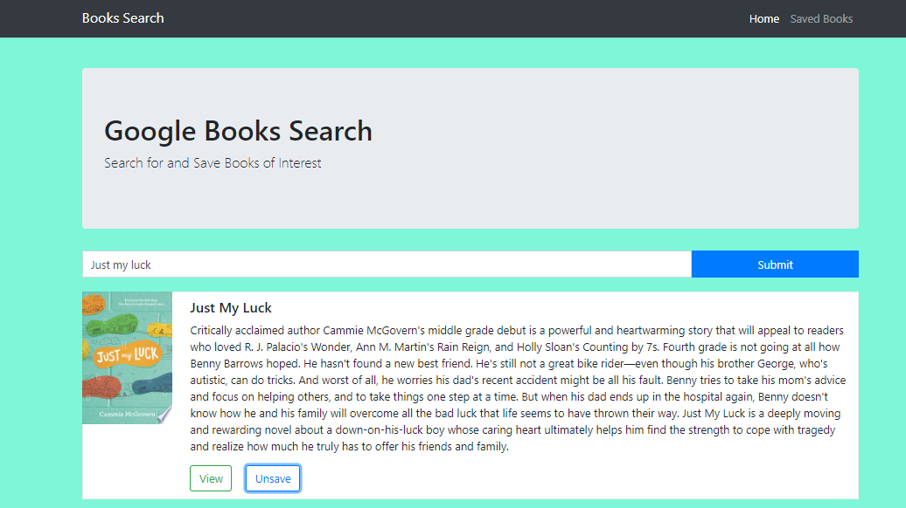
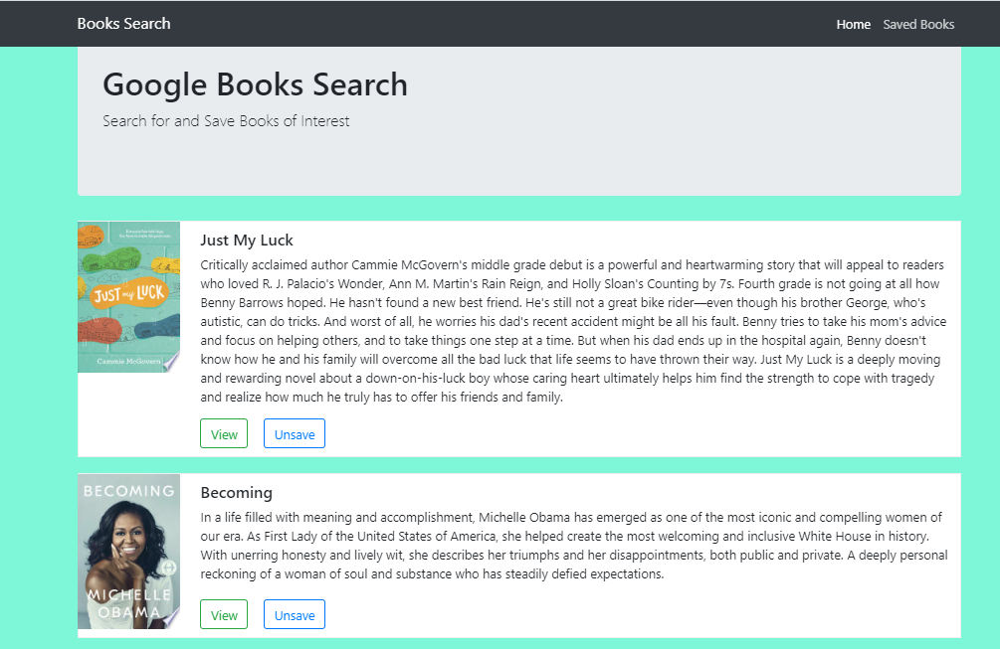

# React-Books-Search
A react based google book search app for book lovers to search for their favorite books.
### Deploy Link: https://www.linkedin.com/in/gisele-soubeiga-87b064196

* Enter the name of the book you wish to search and click the "Search for Books" button
* List of books will appear based on the search query
* Press the "View" button to see more details about the book on the Google Books website
* Or save the book to review later by clicking the "Save" Button
* The books a user saves can be viewed on the "Saved" tab
* Saved books can be deleted by clicking the "Unsaved" button

# Getting Started

To run this application locally, use http://localhost:3000 after completing the following steps.

```js
git clone github.com/Giselesoubeiga/React-Google-Books-Search.git
cd React-Google-Books-Search
npm install
npm start
```

* Technologies Used
* React
* JavaScript
* MongoDB
* Express
* Node
* Google Books API
* Bootstrap

# Screeshot




